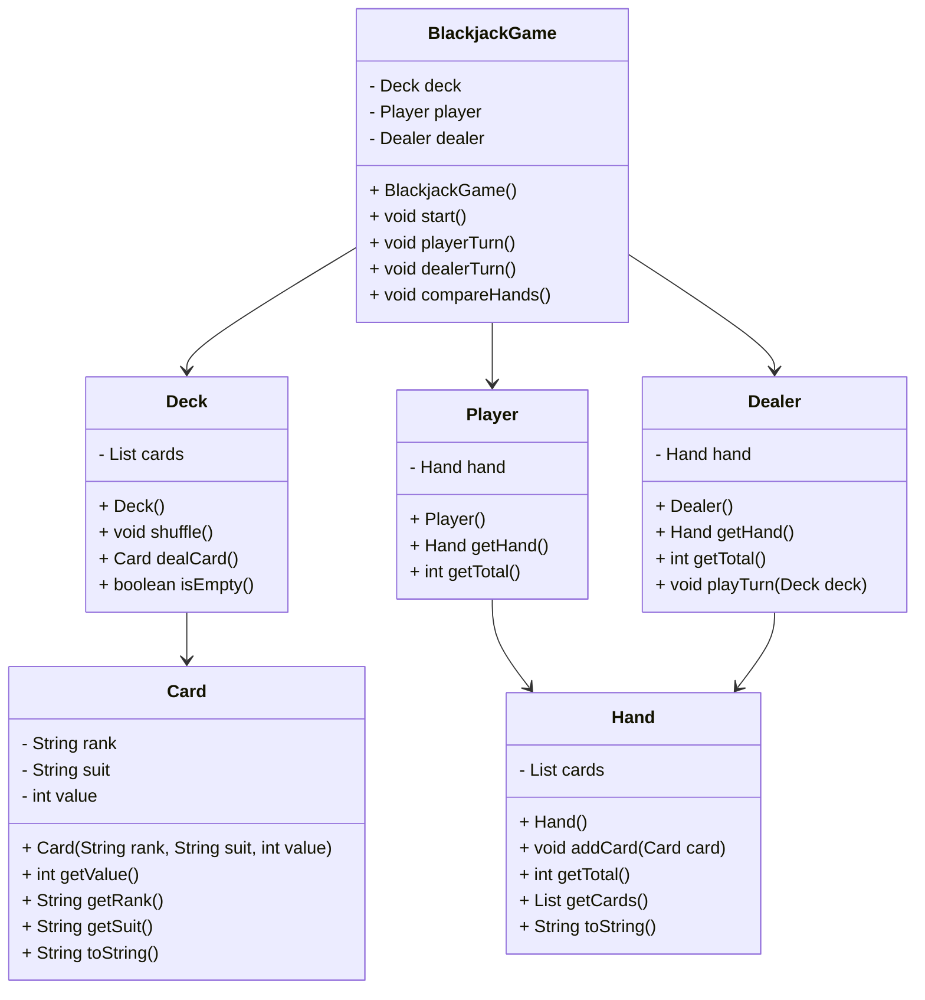

# CS121 Final Project
Final project in CS121 

## Algorithm
* console blackjack game with classes; Card, Deck, Hand, Player, Dealer, and BlackjackGame

1. start
   * public static void main(String[] args) creates a BlackjackGame object
   * call game.start()
2. initialize game
   * create a Deck object
   * call deck.shuffle()
   * create Player and Dealer objects with their own hands
3. deal cards
   * deal 2 cards to player
     * player.getHand().addCard(deck.dealCard());
    * deal 2 cards to dealer
      * dealer.getHand().addCard(deck.dealCard());
4. player turn
   * show players hand and total; player.getHand().getTotal()
   * show one dealer card
   * loop
     * ask user "hit or stand (h/s)"
     * if hit
       * deal one card to player
       * recalculate total
       * if total > 21; print "Bust. Dealer wins." and end game
    * if stand
      * break loop
5. dealer turn
   * reveal dealers full hand
   * while dealers total < 17
     * dealer hits
     * if dealer total > 21; "Dealer busts. Player wins." and end game
6. compare final scores
   * get playerTotal and dealerTotal
   * if playerTotal > dealerTotal "Player wins."
   * else if playerTotal < dealerTotal "Dealer wins."
   * else "Push."
7. end program
   * ask user if they want to play again
