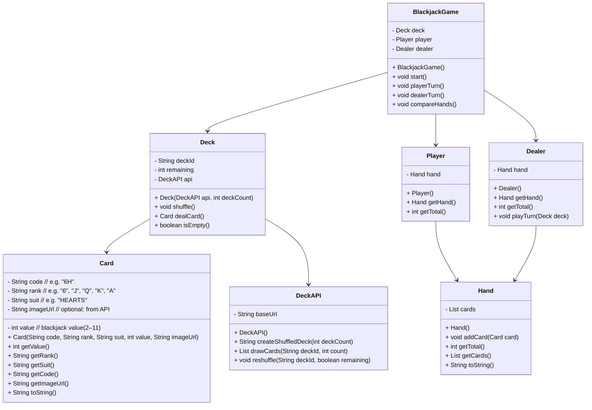

# CS121 Final Project
Final project in CS121 

## algorithm
* console blackjack game with classes; Card, Deck, Hand, Player, Dealer, and BlackjackGame

1. start
   * in public static void main(String[] args):
   * create a BlackjackGame object.
   * call game.start().

3. initialize game
* inside BlackjackGame constructor or start()
  * create a DeckAPI object.
    * create a Deck object:
      * Deck deck = new Deck(deckApi, 1);
      * inside Deck constructor
        * call deckId = api.createShuffledDeck(deckCount);
        * DeckAPI.createShuffledDeck(int deckCount) sends a request
        * parses the JSON, returns the deck_id string.
        * deck stores deckId and remaining from the response.
      * create Player and Dealer objects (each has its own Hand).

3. deal initial cards
   * deal 2 cards to the player
     * call player.getHand().addCard(deck.dealCard()); twice.
     * inside Deck.dealCard()
     * if remaining == 0, optionally call api.reshuffle(deckId, true) or handle empty deck.
     * call api.drawCards(deckId, 1).
     * DeckAPI.drawCards(...)
       * sends request
         parses JSON, builds a Card object with
         * code, rank 
         * returns a List<Card> (size 1) or directly a Card.
         * deck returns that Card.
    * deal 2 cards to the dealer
    * call dealer.getHand().addCard(deck.dealCard()); twice (same process).

5. player Turn
	* show player’s hand and total
        * System.out.println("Your hand: " + player.getHand());
        * System.out.println("Your total: " + player.getTotal());
    * show one dealer card
        * System.out.println("Dealer shows: " + dealer.getHand().getCards().get(0));
    * loop
      * ask "hit or stand (h/s):"
      * if hit
        * call player.getHand().addCard(deck.dealCard());
        * recalculate total with player.getTotal().
        * if total > 21
          * print "Bust. Dealer wins."
          * end game (return from playerTurn()).
	   * if stand:
          * break out of loop and go to dealer turn.

6. dealers turn
   * reveal dealer’s full hand and total
     * System.out.println("Dealer's hand: " + dealer.getHand());
     * System.out.println("Dealer's total: " + dealer.getTotal());
   * while dealer’s total < 17
     * in dealer.playTurn(deck);
       * while getTotal() < 17 and deck not empty
       * hand.addCard(deck.dealCard());
         * after each hit, check for bust
           * if dealer total > 21
           * print "Dealer busts. Player wins."
           * end game (return from dealerTurn()).

7. compare final scores
* if both player and dealer are less than or equal to 21
  * get totals
    * int playerTotal = player.getTotal();
    * int dealerTotal = dealer.getTotal();
    * compare
      * if playerTotal > dealerTotal; "Player wins."
      * if dealerTotal > playerTotal; "Dealer wins."
      * if equal → "It's a tie (push)."
